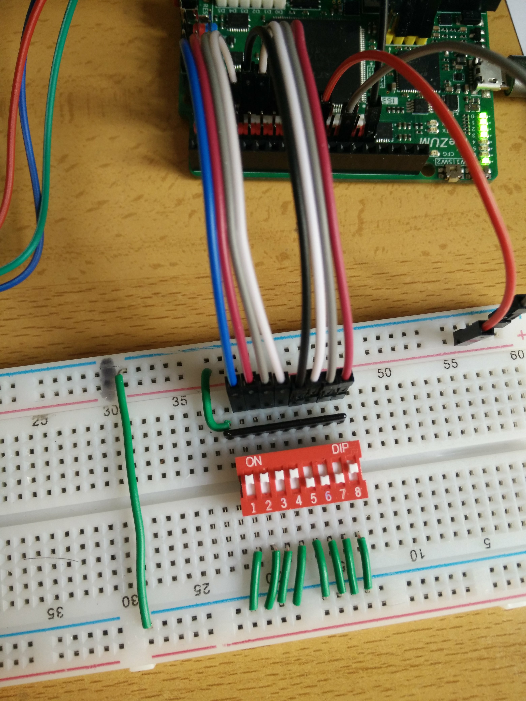
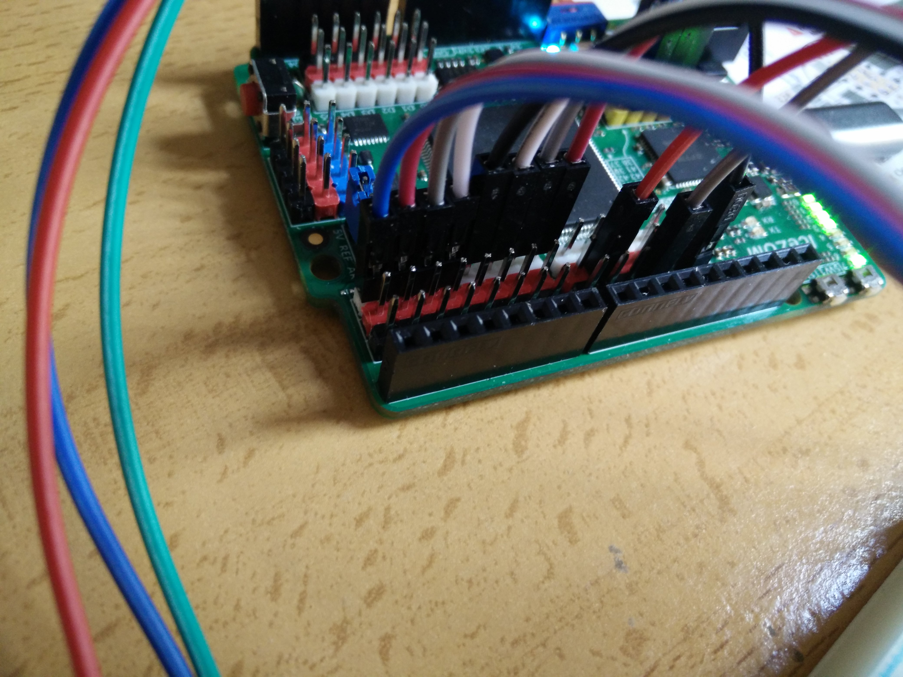
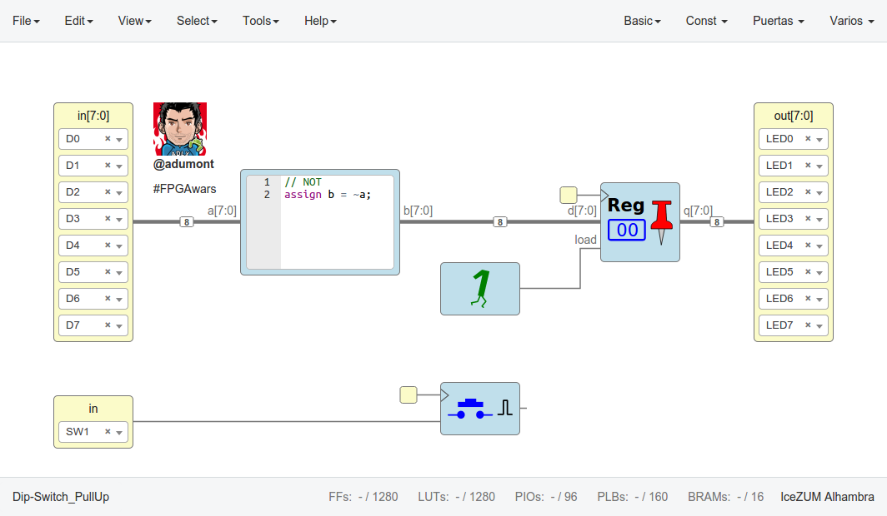

# Input 8bit value using DIP switch with IceZum Alhambra

- [Input 8bit value using DIP switch with IceZum Alhambra](#input-8bit-value-using-dip-switch-with-icezum-alhambra)
- [What we need](#what-we-need)
- [Schematics](#schematics)
- [Circuit in IceStudio](#circuit-in-icestudio)

# What we need

- Breadboard
- [8 poles DIP Switch](https://www.mouser.es/ProductDetail/Omron-Electronics/A6E-8104-N?qs=sGAEpiMZZMv%2f%252b2JhlA6ysK8z9VoUe3M4NRXxMPQBGgI%3d)
- [9 pins 3.3KOhm bussed resistor array](https://www.mouser.es/ProductDetail/652-4609X-1LF-3.3K)

# Schematics

The DIP switch acts as 8 switches. We use the resistor array to connect the dip switch in a Pull-Up configuration.

- When the switch is open, current will flow from Vcc to the PINs.
- When the switch is closed, the pin will be brought down to ground.

# Circuit in IceStudio

In the circuit, the register enable is connected to "1" (always enabled). It can also be connected to the dbouncer, so that it will load only when button is pressed.